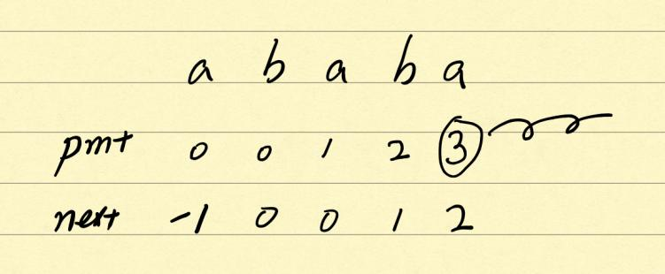

# 28. 实现 strStr()
```
实现 strStr() 函数。

给定一个 haystack 字符串和一个 needle 字符串，在 haystack 字符串中找出 needle 字符串出现的第一个位置 (从0开始)。如果不存在，则返回  -1。

```

## 思路1

https://leetcode-cn.com/problems/implement-strstr/solution/kmp-suan-fa-xiang-jie-by-labuladong/
## 代码1
```java

class Solution {
    public int strStr(String haystack, String needle) {
        if (needle.length() == 0) return 0;
        int[][] dp = kmp(needle);
        int N = haystack.length(), M = needle.length();
        int j = 0;
        for (int i = 0; i < N; i++) {
            j = dp[j][haystack.charAt(i)];
            if (j == M) return i - M + 1;
        }
        return -1;
    }
    public int[][] kmp(String needle) {
        int M = needle.length();
        int[][] dp = new int[M][256];
        dp[0][needle.charAt(0)] = 1; // base condition
        int X = 0; // shadow state
        for (int j = 1; j < M; j++) {
            for (int c = 0; c < 256; c++) {
                if (needle.charAt(j) == (char)c) {
                    dp[j][c] = j + 1;
                } else {
                    dp[j][c] = dp[X][c];
                }
            }
            X = dp[X][needle.charAt(j)];
        }
        return dp;
    }
}


```

## 思路2



首先是部分匹配表（pmt）的含义。pmt表的每一位代表模式字符串从开头到当前位这一段字符串的公共前后缀的最大长度。为了计算方便，将pmt的每一位后移一位（每一位匹配失败后只需要用到前面一位的pmt值），前面填上-1，构成next数组。       

然后是next数组的用法，举例来说，如果模式字符串在最后一位的a上匹配失败，由于next[4] = 2，说明a之前的两位（后缀）与模式字符串的前两位（前缀）是一致的，这样就只需要把前缀移动到后缀的位置上来就可以了（j = next[j])。       

至于next数组的构造方法，方法类似：把原来模式字符串的前缀作为新的模式字符串来匹配原来的模式字符串，匹配方法同上。

## 代码2
```java

class Solution {
    public int strStr(String haystack, String needle) {
        if (needle.length() == 0) return 0;
        int N = haystack.length(), M = needle.length();
        int[] next = getNext(needle);
        int i = 0, j = 0;
        while (i < N && j < M) {
            if (j == -1 || haystack.charAt(i) == needle.charAt(j)) {
                i++;
                j++;
            } else {
                j = next[j];
            }
        }
        if (j == M) {
            return i - j;
        }
        return -1;
    }
    public int[] getNext(String needle) {
        int M = needle.length();
        int[] next = new int[M];
        next[0] = -1;
        int i = 0, j = -1;
        while (i < M) {
            if (j == -1 || needle.charAt(i) == needle.charAt(j)) {
                if (i == M - 1) break;
                i++;
                j++;
                next[i] = j;
            } else {
                j = next[j];
            }
        }
        return next;
    }
}


```


# 438. 找到字符串中所有字母异位词
```
给定一个字符串 s 和一个非空字符串 p，找到 s 中所有是 p 的字母异位词的子串，返回这些子串的起始索引。

字符串只包含小写英文字母，并且字符串 s 和 p 的长度都不超过 20100。

说明：

字母异位词指字母相同，但排列不同的字符串。
不考虑答案输出的顺序。
示例 1:

输入:
s: "cbaebabacd" p: "abc"

输出:
[0, 6]

解释:
起始索引等于 0 的子串是 "cba", 它是 "abc" 的字母异位词。
起始索引等于 6 的子串是 "bac", 它是 "abc" 的字母异位词。
 示例 2:

输入:
s: "abab" p: "ab"

输出:
[0, 1, 2]

解释:
起始索引等于 0 的子串是 "ab", 它是 "ab" 的字母异位词。
起始索引等于 1 的子串是 "ba", 它是 "ab" 的字母异位词。
起始索引等于 2 的子串是 "ab", 它是 "ab" 的字母异位词。
```

## 思路
滑动窗口的通用模板：
```java
string s, t;
// 在 s 中寻找 t 的「最小覆盖子串」
int left = 0, right = 0;
string res = s;

while(right < s.size()) {
    window.add(s[right]);
    right++;
    // 如果符合要求，移动 left 缩小窗口
    while (window 符合要求) {
        // 如果这个窗口的子串更短，则更新 res
        res = minLen(res, window);
        window.remove(s[left]);
        left++;
    }
}
return res;

```
本题使用了两个哈希表：require用来存储字符串T中所有字符出现的次数，cur用来存储当前窗口内各字符出现的次数。另外定义一个match变量表示cur中出现次数等于require的字符数量。那么显然当match的大小等于require中的所有字符数量时，窗口window是符合要求的。

## 代码
```java

class Solution {
    public List<Integer> findAnagrams(String s, String t) {
        Map<Character, Integer> require = new HashMap<>();
        Map<Character, Integer> cur = new HashMap<>();
        for (Character c: t.toCharArray()) {
            required.put(c, require.getOrDefault(c, 0) + 1);
        }
        int left = 0, right = 0;
        int match = 0;
        List<Integer> res = new ArrayList<>();
        while (right < s.length()) {
            Character c = s.charAt(right);
            cur.put(c, cur.getOrDefault(c, 0) + 1);
            right++;
            if (cur.get(c).equals(require.getOrDefault(c, -1))) match++; 
            while (match == require.size()) {
                if (right - left == t.length()) res.add(left);
                Character leftChar = s.charAt(left);
                cur.put(leftChar, cur.get(leftChar) - 1);
                if (cur.get(leftChar) < require.getOrDefault(leftChar, -1)) match--;
                left++;
            }
        }
        return res;
        
    }
}
```

# 76. 最小覆盖子串

```
给你一个字符串 S、一个字符串 T，请在字符串 S 里面找出：包含 T 所有字母的最小子串。

示例：

输入: S = "ADOBECODEBANC", T = "ABC"
输出: "BANC"
说明：

如果 S 中不存这样的子串，则返回空字符串 ""。
如果 S 中存在这样的子串，我们保证它是唯一的答案。
```

## 思路
依然使用的是滑动窗口的思路，只需要对上题代码作稍加改动即可。

## 代码
```java

class Solution {
    public String minWindow(String s, String t) {
        Map<Character, Integer> required = new HashMap<>();
        Map<Character, Integer> cur = new HashMap<>();
        for (Character c: t.toCharArray()) {
            required.put(c, required.getOrDefault(c, 0) + 1);
        }
        int left = 0, right = 0;
        int match = 0;
        int start = 0, minLen = Integer.MAX_VALUE;
        while (right < s.length()) {
            Character c = s.charAt(right);
            cur.put(c, cur.getOrDefault(c, 0) + 1);
            right++;
            if (cur.get(c).equals(required.getOrDefault(c, -1))) match++; 
            while (match == required.size()) {
                if (right - left < minLen) {
                    minLen = right - left;
                    start = left;
                }
                Character leftChar = s.charAt(left);
                cur.put(leftChar, cur.get(leftChar) - 1);
                if (cur.get(leftChar) < required.getOrDefault(leftChar, -1)) match--;
                left++;
            }
        }
        return minLen == Integer.MAX_VALUE ? "" : s.substring(start, start + minLen);
        
    }
} 
```

# 3. 无重复字符的最长子串

```
给定一个字符串，请你找出其中不含有重复字符的 最长子串 的长度。

示例 1:

输入: "abcabcbb"
输出: 3 
解释: 因为无重复字符的最长子串是 "abc"，所以其长度为 3。
示例 2:

输入: "bbbbb"
输出: 1
解释: 因为无重复字符的最长子串是 "b"，所以其长度为 1。
示例 3:

输入: "pwwkew"
输出: 3
解释: 因为无重复字符的最长子串是 "wke"，所以其长度为 3。
     请注意，你的答案必须是 子串 的长度，"pwke" 是一个子序列，不是子串。

```
# 思路1
依然是滑动窗口的思路，只不过这次的内部循环是在窗口不符合要求时执行的，窗口直到符合要求后成为候选结果。

# 代码1
```java

class Solution {
    public int lengthOfLongestSubstring(String s) {
        if (s.length() == 0) return 0;
        Map<Character, Integer> map = new HashMap<>();
        int left = 0, right = 0;
        int res = 1;
        while (right < s.length()) {
            map.put(s.charAt(right), map.getOrDefault(s.charAt(right), 0) + 1);
            while (map.get(s.charAt(right)) > 1) {
                map.put(s.charAt(left), map.get(s.charAt(left)) - 1);
                left++;
            }
            res = Math.max(res, right - left + 1);
            right++;
        }
        
        return res;
    }
}
```

## 思路2
定义窗口左右边界left（exclusive）和right（inclusive）。遍历right时，设置一个哈希函数来存储当前字符上一次出现过的位置（如果是第一次出现则为null）。窗口左边界left必须在当前字符上次出现位置或之后窗口才可能是有效的，因此需要在每一步遍历时将left更新成当前字符上次出现过的位置，但需要注意的是如果left本身就已经在当前字符上次出现过的位置之后了，那么此时就无需再更新left。

## 代码2
```java

class Solution {
    public int lengthOfLongestSubstring(String s) {
        if (s.length() == 0) return 0;
        int left = -1, right = 0;
        Map<Character, Integer> map = new HashMap<>();
        int res = 1;
        while (right < s.length()) {
            if (map.containsKey(s.charAt(right))) {
                left = Math.max(left, map.get(s.charAt(right)));
            }    
            res = Math.max(res, right - left);
            map.put(s.charAt(right), right);
            right++;
        }
        return res;
    }
}
```

# 5. 最长回文子串
```
给定一个字符串 s，找到 s 中最长的回文子串。你可以假设 s 的最大长度为 1000。

示例 1：

输入: "babad"
输出: "bab"
注意: "aba" 也是一个有效答案。
示例 2：

输入: "cbbd"
输出: "bb"

```
## 思路1
中心扩展算法：设字符串s长度为n，则一共存在2n-1个中心。定义一个expandAroundCenter函数，left和right分别代表当前中心的左右边界（边界不包含在回文串内，所以最后返回回文串长度时是right - left - 1）。

## 代码1
```java
class Solution {
    public String longestPalindrome(String s) {
        if (s.length() == 0) return "";
        int left = 0, right = 0, start = 0, end = 0;

        for (int i = 0; i < s.length(); i++) {
            int len1 = expandAroundCenter(s, i, i);
            int len2 = expandAroundCenter(s, i, i + 1);
            int len = Math.max(len1, len2);
            if (len > end - start + 1) {
                start = i - (len - 1) / 2;
                end = i + len / 2;
            }
        }

        return s.substring(start, end + 1);
    }

    public int expandAroundCenter(String s, int left, int right) {
        while (left >= 0 && right < s.length() && s.charAt(left) == s.charAt(right)) {
            left--;
            right++;
        }

        return right - left - 1;
    }
}
```


## 思路2
Manacher算法：http://www.cnblogs.com/grandyang/p/4475985.html

## 代码2
```java
class Solution {
    public String longestPalindrome(String s) {
        if (s.length() == 0) return s;
        StringBuilder sb = new StringBuilder("$#");
        for (int i = 0; i < s.length(); i++) { sb.append(s.charAt(i) + "#"); }
        sb.append('@'); // 与字符串sb的第一个字符$不同
        
        int[] lenArr = new int[sb.length()];

        int mx = 0, id = 0, resId = 0, resLen = 0;

        for (int i = 1; i < sb.length() - 1; i++) {
            // 确定以i为中心的回文串的最小半径
            lenArr[i] = i >= mx ? 1 : Math.min(mx - i, lenArr[2 * id - i]);

            // 找到以i为中心的回文串的最大半径
            while (sb.charAt(i + lenArr[i]) == sb.charAt(i - lenArr[i])) { lenArr[i]++; }
            
            // 尝试更新mx与id
            if (i + lenArr[i] > mx) {
                mx = i + lenArr[i];
                id = i;
            }

            // 尝试更新结果
            if (lenArr[i] > resLen) {
                resLen = lenArr[i];
                resId = i;
            }
        }
        return s.substring((resId - resLen) / 2, (resId - resLen) / 2 + resLen - 1);
    }
}
```

# 1143. 最长公共子序列
```
给定两个字符串 text1 和 text2，返回这两个字符串的最长公共子序列。

一个字符串的 子序列 是指这样一个新的字符串：它是由原字符串在不改变字符的相对顺序的情况下删除某些字符（也可以不删除任何字符）后组成的新字符串。
例如，"ace" 是 "abcde" 的子序列，但 "aec" 不是 "abcde" 的子序列。两个字符串的「公共子序列」是这两个字符串所共同拥有的子序列。

若这两个字符串没有公共子序列，则返回 0。

 

示例 1:

输入：text1 = "abcde", text2 = "ace" 
输出：3  
解释：最长公共子序列是 "ace"，它的长度为 3。
示例 2:

输入：text1 = "abc", text2 = "abc"
输出：3
解释：最长公共子序列是 "abc"，它的长度为 3。
示例 3:

输入：text1 = "abc", text2 = "def"
输出：0
解释：两个字符串没有公共子序列，返回 0。
 

提示:

1 <= text1.length <= 1000
1 <= text2.length <= 1000
输入的字符串只含有小写英文字符。

```


## 代码

```java
class Solution {
    public class Tuple {
        public int x;
        public int y;
        public Tuple(int x, int y) {
            this.x = x;
            this.y = y;
        }
    }

    public int longestCommonSubsequence(String text1, String text2) {
        int size1 = text1.length(), size2 = text2.length();

        int[][] dp = new int[size1 + 1][size2 + 1];
        Tuple[][] back = new Tuple[size1 + 1][size2 + 1]; // back数组存储回溯路径

        for (int i = 0; i < size1; i++) {
            for (int j = 0; j < size2; j++) {
                if (text1.charAt(i) == text2.charAt(j)) {
                    dp[i + 1][j + 1] = dp[i][j] + 1;
                    back[i + 1][j + 1] = new Tuple(i, j);
                }
                else if (dp[i + 1][j] > dp[i][j + 1]) {
                    dp[i + 1][j + 1] = dp[i + 1][j];
                    back[i + 1][j + 1] = new Tuple(i + 1, j);
                } else {
                    dp[i + 1][j + 1] = dp[i][j + 1];
                    back[i + 1][j + 1] = new Tuple(i, j + 1);
                }
            }
        }

        StringBuilder sb = new StringBuilder();
        int x = size1, y = size2;
        while (x > 0) {
            if (back[x][y].x == x - 1 && back[x][y].y == y - 1) {
                sb.append(text1.charAt(x - 1));
            }

            Tuple t = back[x][y];
            x = t.x;
            y = t.y;
        }

        System.out.println(sb.reverse().toString()); // 输出其中一个最长公共子序列

        return dp[size1][size2];
        
    }
}
```

# 796. 旋转字符串
```
给定两个字符串, A 和 B。

A 的旋转操作就是将 A 最左边的字符移动到最右边。 例如, 若 A = 'abcde'，在移动一次之后结果就是'bcdea' 。如果在若干次旋转操作之后，A 能变成B，那么返回True。

示例 1:
输入: A = 'abcde', B = 'cdeab'
输出: true

示例 2:
输入: A = 'abcde', B = 'abced'
输出: false
注意：

A 和 B 长度不超过 100。

```

## 代码
```java
class Solution {
    public boolean rotateString(String A, String B) {
        return (A.length() == B.length()) && (A + A).contains(B);
    }
}
```

# 44. 通配符匹配
```
给定一个字符串 (s) 和一个字符模式 (p) ，实现一个支持 '?' 和 '*' 的通配符匹配。

'?' 可以匹配任何单个字符。
'*' 可以匹配任意字符串（包括空字符串）。
两个字符串完全匹配才算匹配成功。

说明:

s 可能为空，且只包含从 a-z 的小写字母。
p 可能为空，且只包含从 a-z 的小写字母，以及字符 ? 和 *。
示例 1:

输入:
s = "aa"
p = "a"
输出: false
解释: "a" 无法匹配 "aa" 整个字符串。
示例 2:

输入:
s = "aa"
p = "*"
输出: true
解释: '*' 可以匹配任意字符串。
示例 3:

输入:
s = "cb"
p = "?a"
输出: false
解释: '?' 可以匹配 'c', 但第二个 'a' 无法匹配 'b'。
示例 4:

输入:
s = "adceb"
p = "*a*b"
输出: true
解释: 第一个 '*' 可以匹配空字符串, 第二个 '*' 可以匹配字符串 "dce".
示例 5:

输入:
s = "acdcb"
p = "a*c?b"
输入: false


```

## 代码1（DP）
```java
class Solution {
    public boolean isMatch(String s, String p) {
        boolean[][] dp = new boolean[s.length() + 1][p.length() + 1];
        dp[0][0] = true;
        for (int j = 1; j <= p.length(); j++) {
            if (p.charAt(j - 1) == '*') dp[0][j] = dp[0][j - 1];
        }

        for (int i = 1; i <= s.length(); i++) {
            for (int j = 1; j <= p.length(); j++) {
                if (p.charAt(j - 1) == '*') dp[i][j] = dp[i][j - 1] || dp[i - 1][j];
                else dp[i][j] = (s.charAt(i - 1) == p.charAt(j - 1) || p.charAt(j - 1) == '?') && dp[i - 1][j - 1];
            }
        }

        return dp[s.length()][p.length()];
    }
}
```

## 思路2
定义两个变量star和star_s，star代表模式串p中上一个\*的位置，star_s代表star在s中所匹配的字符串之后的一个字符的索引。当在p中第一次遇到\*时，将对应的star_s设置为i，代表star一开始只匹配0个字符。

当i和j匹配失败时，进行回溯，即重置j为star的下一个字符，star_s增1（代表star又多匹配了一个字符），同时将i设置为star_s。

## 代码2

```java
class Solution {
    public boolean isMatch(String s, String p) {
        s = s.concat("$");
        p = p.concat("$");

        int star = -1, star_s = -1, i = 0, j = 0;

        while (i < s.length()) {
            if (s.charAt(i) == p.charAt(j) || p.charAt(j) == '?') {
                i++;
                j++;
            } else if (p.charAt(j) == '*'){
                star = j++;
                star_s = i;
            } else if (star != -1){
                j = star + 1;
                i = ++star_s;
            } else {
                return false;
            }
        }

        while (j < p.length() - 1) {
            if (p.charAt(j) != '*') return false;
            j++;
        }

        return true;
    }
}
```

# 10. 正则表达式匹配
```
给你一个字符串 s 和一个字符规律 p，请你来实现一个支持 '.' 和 '*' 的正则表达式匹配。

'.' 匹配任意单个字符
'*' 匹配零个或多个前面的那一个元素
所谓匹配，是要涵盖 整个 字符串 s的，而不是部分字符串。

说明:

s 可能为空，且只包含从 a-z 的小写字母。
p 可能为空，且只包含从 a-z 的小写字母，以及字符 . 和 *。
示例 1:

输入:
s = "aa"
p = "a"
输出: false
解释: "a" 无法匹配 "aa" 整个字符串。
示例 2:

输入:
s = "aa"
p = "a*"
输出: true
解释: 因为 '*' 代表可以匹配零个或多个前面的那一个元素, 在这里前面的元素就是 'a'。因此，字符串 "aa" 可被视为 'a' 重复了一次。
示例 3:

输入:
s = "ab"
p = ".*"
输出: true
解释: ".*" 表示可匹配零个或多个（'*'）任意字符（'.'）。
示例 4:

输入:
s = "aab"
p = "c*a*b"
输出: true
解释: 因为 '*' 表示零个或多个，这里 'c' 为 0 个, 'a' 被重复一次。因此可以匹配字符串 "aab"。
示例 5:

输入:
s = "mississippi"
p = "mis*is*p*."
输出: false

```

## 代码（DP）

```java
class Solution {
    public boolean isMatch(String s, String p) {
        boolean[][] dp = new boolean[s.length() + 1][p.length() + 1];
        dp[0][0] = true;

        for (int i = 0; i <= s.length(); i++) {
            for (int j = 1; j <= p.length(); j++) {
                if (p.charAt(j - 1) == '*') {
                    dp[i][j] = dp[i][j - 2] || (i > 0 && (s.charAt(i - 1) == p.charAt(j - 2) || p.charAt(j - 2) == '.') && dp[i - 1][j]);
                } else {
                    dp[i][j] = i > 0 && (s.charAt(i - 1) == p.charAt(j - 1) || p.charAt(j - 1) == '.') && dp[i - 1][j - 1];
                }
            }
        }

        return dp[s.length()][p.length()];

    }
}
```

# 459. 重复的子字符串
```
给定一个非空的字符串，判断它是否可以由它的一个子串重复多次构成。给定的字符串只含有小写英文字母，并且长度不超过10000。

示例 1:

输入: "abab"

输出: True

解释: 可由子字符串 "ab" 重复两次构成。
示例 2:

输入: "aba"

输出: False
示例 3:

输入: "abcabcabcabc"

输出: True

解释: 可由子字符串 "abc" 重复四次构成。 (或者子字符串 "abcabc" 重复两次构成。)

```
## 代码

```java
class Solution {
    public boolean repeatedSubstringPattern(String s) {
        // 假设字符串s可以由其中一个子串重复多次构成，设这个子串为t，重复次数为N（N > 1）。
        // 将字符串s首尾拼接，构成字符串2s。那么2s就是由2N个子串t构成。
        // 分别去掉字符串2s首尾字符，构成字符串2s-2。那么2s-2就是由(2N-2)个子串t构成。
        // 由于(2N-2)/2>0，也即字符串2s-2至少会包含一个字符串s。

        return (s + s).substring(1, 2 * s.length() - 1).contains(s);
    }
}
```

# 72. 编辑距离
```
给定两个单词 word1 和 word2，计算出将 word1 转换成 word2 所使用的最少操作数 。

你可以对一个单词进行如下三种操作：

插入一个字符
删除一个字符
替换一个字符
示例 1:

输入: word1 = "horse", word2 = "ros"
输出: 3
解释: 
horse -> rorse (将 'h' 替换为 'r')
rorse -> rose (删除 'r')
rose -> ros (删除 'e')
示例 2:

输入: word1 = "intention", word2 = "execution"
输出: 5
解释: 
intention -> inention (删除 't')
inention -> enention (将 'i' 替换为 'e')
enention -> exention (将 'n' 替换为 'x')
exention -> exection (将 'n' 替换为 'c')
exection -> execution (插入 'u')

```

## 代码

```java
class Solution {
    public int minDistance(String word1, String word2) {
        int[][] dp = new int[word1.length() + 1][word2.length() + 1];

        for (int i = 1; i <= word1.length(); i++) dp[i][0] = i;
        for (int j = 1; j <= word2.length(); j++) dp[0][j] = j;

        for (int i = 1; i <= word1.length(); i++) {
            for (int j = 1; j <= word2.length(); j++) {
                if (word1.charAt(i - 1) == word2.charAt(j - 1)) dp[i][j] = dp[i - 1][j - 1];
                else {
                    dp[i][j] = 1 + Math.min(dp[i - 1][j - 1], // 替换操作：将word1的第i个字符替换成word2的第j个字符，剩下就需要将word1的前i-1个字符替换成word2的前j-1个字符
                        Math.min(
                            dp[i - 1][j], // 删除操作：删除word1的第i个字符以后，需要将word1的前i-1个字符转换成word2的前j个字符
                            dp[i][j - 1]  // 插入操作：在word1中插入一个字符之后，word1的第i+1个字符对应word2的第j个字符，因此需要将word1的前i个字符转换成word2的前j-1个字符
                        )
                    );
                }
            }
        }

        return dp[word1.length()][word2.length()];
    }
}
```

# 522. 最长特殊序列 II

```
给定字符串列表，你需要从它们中找出最长的特殊序列。最长特殊序列定义如下：该序列为某字符串独有的最长子序列（即不能是其他字符串的子序列）。

子序列可以通过删去字符串中的某些字符实现，但不能改变剩余字符的相对顺序。空序列为所有字符串的子序列，任何字符串为其自身的子序列。

输入将是一个字符串列表，输出是最长特殊序列的长度。如果最长特殊序列不存在，返回 -1 。

 

示例：

输入: "aba", "cdc", "eae"
输出: 3
 

提示：

所有给定的字符串长度不会超过 10 。
给定字符串列表的长度将在 [2, 50 ] 之间。
 
```

## 题解
https://leetcode-cn.com/problems/longest-uncommon-subsequence-ii/solution/java-treemap-zi-fu-chuan-by-tyh7/

## 代码

```java
class Solution {
    public int findLUSlength(String[] strs) {
        //自定义比较器：根据字符串长度
        Comparator<String> strLenComparator = new Comparator<String>() {
            @Override
            public int compare(String s1, String s2) {
                if(s1.length() > s2.length()) return -1;
                else if(s1.length() < s2.length()) return 1;
                else return s1.compareTo(s2);   //长度相等就按照字典序排序
            }
        };
        //按照字符串长度降序，放入map中，并且注意统计字符串的出现次数
        TreeMap<String, Integer> sortedMap = new TreeMap<>(strLenComparator);
        for(String str : strs) {
            sortedMap.put(str, sortedMap.getOrDefault(str, 0) + 1);
        }
        //寻找最长特殊字串
        Set<String> set = new HashSet<>();
        for(String str : sortedMap.keySet()) {
            boolean isLUS = true;
            if(sortedMap.get(str) == 1) {
                for(String str2 : set) {
                    if(contains(str2, str)) { //当前字符串是比它长的字符串的子串
                        isLUS = false;
                        break;
                    }
                }
                if(isLUS) return str.length();
            }
            set.add(str);   //已经check过的string
        }
        return -1;
    }
    //判断字符串a是否模糊包含字符串b
    boolean contains(String a, String b) {
        int i = 0, j = 0;
        while(i < a.length() && j < b.length()) {
            if(a.charAt(i) == b.charAt(j)) {
                i++;
                j++;
            }else {
                i++;
            }
        }
        return j == b.length();
    }
}

```