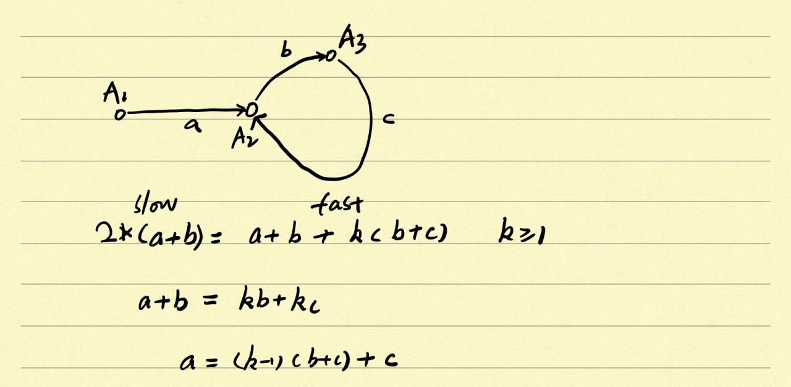

# 206. 反转链表

## 代码（递归方法）
```java
/**
 * Definition for singly-linked list.
 * public class ListNode {
 *     int val;
 *     ListNode next;
 *     ListNode(int x) { val = x; }
 * }
 */
class Solution {
    public ListNode reverseList(ListNode head) {
        if (head == null || head.next == null) return head;
        
        ListNode temp = head;
        head = reverseList(head.next);
        temp.next.next = temp;
        temp.next = null;
        
        return head;
    }
}
```

## 代码（迭代方法）
```java
/**
 * Definition for singly-linked list.
 * public class ListNode {
 *     int val;
 *     ListNode next;
 *     ListNode(int x) { val = x; }
 * }
 */
class Solution {
    public ListNode reverseList(ListNode head) {
        ListNode cur = head, next = null, pre = null;
        
        while (cur != null) {
            next = cur.next;
            cur.next = pre;
            pre = cur;
            cur = next;
        }
        
        return pre;
    }
}
```

# 92. 反转链表 II
```
反转从位置 m 到 n 的链表。请使用一趟扫描完成反转。

说明:
1 ≤ m ≤ n ≤ 链表长度。

示例:

输入: 1->2->3->4->5->NULL, m = 2, n = 4
输出: 1->4->3->2->5->NULL

```

## 代码

```java

/**
 * Definition for singly-linked list.
 * public class ListNode {
 *     int val;
 *     ListNode next;
 *     ListNode(int x) { val = x; }
 * }
 */
class Solution {
    public ListNode reverseBetween(ListNode head, int m, int n) {
        ListNode pre = new ListNode(-1);
        pre.next = head;
        
        for (int i = 0; i < m - 1; i++) pre = pre.next;
        ListNode cur = pre.next;
        
        for (int i = 0; i < n - m; i++) {
            ListNode next = cur.next;
            cur.next = next.next;
            next.next = pre.next;
            pre.next = next;
        }
        
        return m == 1 ? pre.next : head;
    }
    
}


```

# 86. 分隔链表
```
给定一个链表和一个特定值 x，对链表进行分隔，使得所有小于 x 的节点都在大于或等于 x 的节点之前。

你应当保留两个分区中每个节点的初始相对位置。

示例:

输入: head = 1->4->3->2->5->2, x = 3
输出: 1->2->2->4->3->5

```

## 代码

```java

/**
 * Definition for singly-linked list.
 * public class ListNode {
 *     int val;
 *     ListNode next;
 *     ListNode(int x) { val = x; }
 * }
 */
class Solution {
    public ListNode partition(ListNode head, int x) {
        ListNode before = new ListNode(0);
        ListNode after = new ListNode(0);
        ListNode beforeHead = before;
        ListNode afterHead = after;
        while (head != null) {
            if (head.val < x) {
                before.next = head;
                before = before.next;
            } else {
                after.next = head;
                after = after.next;
            }
            head = head.next;
        }
        after.next = null; // 记得将链表末尾设置为null，否则会内存溢出
        before.next = afterHead.next;
        return beforeHead.next;
    }
}


```

# 142. 环形链表 II
```
给定一个链表，返回链表开始入环的第一个节点。 如果链表无环，则返回 null。

为了表示给定链表中的环，我们使用整数 pos 来表示链表尾连接到链表中的位置（索引从 0 开始）。 如果 pos 是 -1，则在该链表中没有环。

说明：不允许修改给定的链表。

 

示例 1：

输入：head = [3,2,0,-4], pos = 1
输出：tail connects to node index 1
解释：链表中有一个环，其尾部连接到第二个节点。

示例 2：

输入：head = [1,2], pos = 0
输出：tail connects to node index 0
解释：链表中有一个环，其尾部连接到第一个节点。

示例 3：

输入：head = [1], pos = -1
输出：no cycle
解释：链表中没有环。


进阶：
你是否可以不用额外空间解决此题？

```
## 思路


假设slow和fast在A3相遇，根据以上公式（fast在与slow相遇前走过了k圈），head从A1出发，slow从A3出发，经过a步以后，两点将在A2相遇。

扩展问题：
判断两个链表是否相交？
1、两个链表皆无环：判断两个末尾结点是否相同。
2、两个链表皆有环：找到其中一个链表环的开始结点，判断这个结点是否在另一个链表中。
3、其中一个链表有环：不存在这种情况。

## 代码

```java
/**
 * Definition for singly-linked list.
 * class ListNode {
 *     int val;
 *     ListNode next;
 *     ListNode(int x) {
 *         val = x;
 *         next = null;
 *     }
 * }
 */
public class Solution {
    public ListNode detectCycle(ListNode head) {
        ListNode slow = head, fast = head;
        while (fast != null && fast.next != null) {
            slow = slow.next;
            fast = fast.next.next;
            if (slow == fast) {
                while (slow != head) {
                    slow = slow.next;
                    head = head.next;
                }
                
                return slow;
            };
        }
        return null;
    }
}
```

# 23. 合并K个排序链表

## 思路
先分治，再合并。时间复杂度为O(N * logk)。

## 代码

```java
/**
 * Definition for singly-linked list.
 * public class ListNode {
 *     int val;
 *     ListNode next;
 *     ListNode(int x) { val = x; }
 * }
 */
class Solution {
    public ListNode mergeKLists(ListNode[] lists) {
        if (lists.length == 0) return null;
        return helper(lists, 0, lists.length - 1);
    }
    
    public ListNode helper(ListNode[] lists, int start, int end) {
        if (start == end) return lists[start];
        
        int mid = (start + end) >>> 1;
        return merge2Lists(helper(lists, start, mid), helper(lists, mid + 1, end));
    }
    
    public ListNode merge2Lists(ListNode list1, ListNode list2) {
        ListNode ret = new ListNode(-1);
        ListNode cur = ret;
        
        while (list1 != null && list2 != null) {
            if (list1.val < list2.val) {
                cur.next = list1;
                list1 = list1.next;
            } else {
                cur.next = list2;
                list2 = list2.next;
            }
            cur = cur.next;
        }
        
        if (list1 != null) {
            cur.next = list1;
        }
        
        if (list2 != null) {
            cur.next = list2;
        }
        
        return ret.next;
    } 
}
```

# 143. 重排链表
```
给定一个单链表 L：L0→L1→…→Ln-1→Ln ，
将其重新排列后变为： L0→Ln→L1→Ln-1→L2→Ln-2→…

你不能只是单纯的改变节点内部的值，而是需要实际的进行节点交换。

示例 1:

给定链表 1->2->3->4, 重新排列为 1->4->2->3.
示例 2:

给定链表 1->2->3->4->5, 重新排列为 1->5->2->4->3.
```

## 思路
将给定链表从中间断开分成两个链表cur1与cur2，然后反转cur2，最后将cur1与cur2交叉合并。

## 代码

```java
/**
 * Definition for singly-linked list.
 * public class ListNode {
 *     int val;
 *     ListNode next;
 *     ListNode(int x) { val = x; }
 * }
 */
class Solution {
    public void reorderList(ListNode head) {
        if (head == null) return;
        int len = 0;
        ListNode cur1 = head;
        while (cur1 != null) {
            cur1 = cur1.next;
            len++;
        }
        
        cur1 = head;
        int mid = (len + 1) >> 1;
        while (mid-- > 1) {
            cur1 = cur1.next;
        }
        
        ListNode cur2 = cur1.next;
        cur1.next = null;
        
        cur1 = head;
        cur2 = reverseList(cur2);
        
        while (cur2 != null) {
            ListNode temp = cur2;
            cur2 = cur2.next;
            
            temp.next = cur1.next;
            cur1.next = temp;
            cur1 = cur1.next.next;
        }
        
    }
    
    private ListNode reverseList(ListNode head) {
        if (head == null || head.next == null) return head;
        ListNode temp = head; 
        head = reverseList(head.next); 
        temp.next.next = temp; 
        temp.next = null; 
        return head; 
    }
}
```

# 138. 复制带随机指针的链表

```
给定一个链表，每个节点包含一个额外增加的随机指针，该指针可以指向链表中的任何节点或空节点。

要求返回这个链表的深拷贝。 


输入：
{"$id":"1","next":{"$id":"2","next":null,"random":{"$ref":"2"},"val":2},"random":{"$ref":"2"},"val":1}

解释：
节点 1 的值是 1，它的下一个指针和随机指针都指向节点 2 。
节点 2 的值是 2，它的下一个指针指向 null，随机指针指向它自己。
 

提示：

你必须返回给定头的拷贝作为对克隆列表的引用。
```

## 思路1
将原链表中的节点值以及next指针深拷贝成一条新的链表，而对原链表节点的random指针仅作浅拷贝，即新链表节点的random指针依然指向原链表中的节点。同时利用哈希表将深拷贝对应的新旧节点存储下来。最后遍历新的链表，将每一个节点的random指针指向哈希表中原random指针指向的节点所对应的节点。

事件复杂度为O(n)，空间复杂度为O(n)。

## 代码1
```java
/*
// Definition for a Node.
class Node {
    public int val;
    public Node next;
    public Node random;

    public Node() {}

    public Node(int _val,Node _next,Node _random) {
        val = _val;
        next = _next;
        random = _random;
    }
};
*/
class Solution {
    public Node copyRandomList(Node head) {
        if (head == null) return null;
        Map<Node, Node> map = new HashMap<>();
        
        Node ret = new Node(-1);
        Node retCur = ret;
        Node cur = head;
        
        while (cur != null) {
            retCur.next = new Node();
            retCur = retCur.next;
            retCur.val = cur.val;
            retCur.random = cur.random;
            map.put(cur, retCur);
            
            cur = cur.next;
        }
        
        retCur = ret.next;
        while (retCur != null) {
            retCur.random = map.get(retCur.random);
            retCur = retCur.next;
        }
        
        return ret.next;
    }
}
```

## 思路2
不使用哈希表，而是把复制后的新节点插入到旧节点之后。这样对于任何一个旧节点，它的next指针就是指向其对应的新节点。之后通过一次遍历修改所有新节点的random指针。最后再经过一次遍历将新旧链表拆分开来。

时间复杂度仍然为O(n)，空间复杂度减少到了O(1)。


## 代码2
```java
/*
// Definition for a Node.
class Node {
    public int val;
    public Node next;
    public Node random;

    public Node() {}

    public Node(int _val,Node _next,Node _random) {
        val = _val;
        next = _next;
        random = _random;
    }
};
*/
class Solution {
    public Node copyRandomList(Node head) {
        if (head == null) return null;
        
        Node cur = head;
        while (cur != null) {
            Node node = new Node(cur.val);
            node.next = cur.next;
            node.random = cur.random;
            cur.next = node;
            cur = cur.next.next;
        }
        
        cur = head;
        Node ret = head.next;
        Node retCur = ret;
    
        while (true) {
            if (cur.random != null) retCur.random = cur.random.next;
            cur = cur.next.next;
            if (cur == null) break;
            retCur = retCur.next.next;
        }
        
        cur = head;
        retCur = head.next;
        
        while (true) {
            cur.next = retCur.next;
            cur = cur.next;
            if (cur == null) break;
            retCur.next = cur.next;
            retCur = retCur.next;
        }
        
        return ret;
    }
}
```

# 460. LFU缓存
```
设计并实现最不经常使用（LFU）缓存的数据结构。它应该支持以下操作：get 和 put。

get(key) - 如果键存在于缓存中，则获取键的值（总是正数），否则返回 -1。
put(key, value) - 如果键不存在，请设置或插入值。当缓存达到其容量时，它应该在插入新项目之前，使最不经常使用的项目无效。在此问题中，当存在平局（即两个或更多个键具有相同使用频率）时，最近最少使用的键将被去除。

进阶：
你是否可以在 O(1) 时间复杂度内执行两项操作？

示例：

LFUCache cache = new LFUCache( 2 /* capacity (缓存容量) */ );

cache.put(1, 1);
cache.put(2, 2);
cache.get(1);       // 返回 1
cache.put(3, 3);    // 去除 key 2
cache.get(2);       // 返回 -1 (未找到key 2)
cache.get(3);       // 返回 3
cache.put(4, 4);    // 去除 key 1
cache.get(1);       // 返回 -1 (未找到 key 1)
cache.get(3);       // 返回 3
cache.get(4);       // 返回 4

```

## 思路
在java里直接用LinkedHashSet/LinkedHashMap实现双向链表。

需要一个node结构key, value, freq 这里的<key,value>就是我们要存储的缓存数据的<key,value>，freq是该数据的出现频率

两个hashmap：
CacheMap: hashmap<Integer, Node> 这个map就是为了实现直接put/get数据，不涉及频率更新操作。

freqMap : hashmap<Integer, LinkedHashSet<Node>> key是出现频率，value是对应出现同样频率的所有Node结点（频率一样使用最近最少使用LRU原则）。这个表不涉及put/get数据，涉及update，负责处理频率相关操作。

实现的操作：
get(key) :
如果key不存在，返回-1，
否则得到node，update(node)，返回node.value

put(key,value):
如果cap<=0，直接return
如果key已经存在，update(node)，
否则，key不存在，为key建立一个新的node，频率设置为1
如果freqMap没有频率为1的entry，就加一个频率为1的entry
如果cacheMap的容量>cap，需要通过查找minFreq对应的一串Node，找到LinkedHashset里的第一个node，删掉他，同时在cacheMap里也删掉他。
最后，reset minFreq=1

update(node):
首先得到node.freq对应的linkedhashset的那一串node，也就是找出和node频率一样的其他node。然后在这一串node里去掉这个node，因为这个node的频率变了，+1了。
如果这一串set空了，并且当前node频率是最小的频率，那么minFreq要+1
node.Freq+1
如果freqMap里没有node现在的频率，就给他新建一个LinkedHashSet，key为当前node的频率，放到freqMap里

作者：kao-la-7
链接：https://leetcode-cn.com/problems/lfu-cache/solution/java-shuang-hashmap-linkedhashset-o1shi-xian-by-ka/


## 代码

```java
class LFUCache {
    class Node {
        int key;
        int value;
        int freq;
        
        public Node(int key, int value, int freq) {
            this.key = key;
            this.value = value;
            this.freq = freq;
        }
    }
    
    Map<Integer, Node> cacheMap;
    Map<Integer, LinkedHashSet<Node>> freqMap;
    int cap;
    int minFreq;

    public LFUCache(int capacity) {
        minFreq = 0;
        cap = capacity;
        cacheMap = new HashMap<>();
        freqMap = new HashMap<>();
    }
    
    public int get(int key) {
        if (!cacheMap.containsKey(key)) {
            return -1;
        }
        
        return update(cacheMap.get(key)).value; 
    }
    
    public void put(int key, int value) {
        if (cap <= 0) return;
        
        if (cacheMap.containsKey(key)) {
            cacheMap.get(key).value = value;
            update(cacheMap.get(key));
        } else {
            Node newNode = new Node(key, value, 1);
            if (!freqMap.containsKey(1) || freqMap.get(1).isEmpty()) {
                freqMap.put(1, new LinkedHashSet<>());
            }
            
            freqMap.get(1).add(newNode);
            cacheMap.put(key, newNode);
            
            if (cacheMap.size() > cap) {
                int removeKey = freqMap.get(minFreq).iterator().next().key;
                freqMap.get(minFreq).remove(freqMap.get(minFreq).iterator().next());
                cacheMap.remove(removeKey);
            }
            
            minFreq = 1;
        }
    }
    
    public Node update(Node node) {
        freqMap.get(node.freq).remove(node);
        if (freqMap.get(node.freq).isEmpty() && node.freq == minFreq) {
            freqMap.put(node.freq, new LinkedHashSet<>());
            minFreq += 1;
        }
        
        node.freq += 1;
        if (!freqMap.containsKey(node.freq)) {
            freqMap.put(node.freq, new LinkedHashSet<>());
        }
        
        freqMap.get(node.freq).add(node);
        return node;
    }
    
}

/**
 * Your LFUCache object will be instantiated and called as such:
 * LFUCache obj = new LFUCache(capacity);
 * int param_1 = obj.get(key);
 * obj.put(key,value);
 */
```

# 109. 有序链表转换二叉搜索树
```
给定一个单链表，其中的元素按升序排序，将其转换为高度平衡的二叉搜索树。

本题中，一个高度平衡二叉树是指一个二叉树每个节点 的左右两个子树的高度差的绝对值不超过 1。

示例:

给定的有序链表： [-10, -3, 0, 5, 9],

一个可能的答案是：[0, -3, 9, -10, null, 5], 它可以表示下面这个高度平衡二叉搜索树：

      0
     / \
   -3   9
   /   /
 -10  5

```

## 思路
使用快慢指针找到链表的中点。中点节点作为根节点，左链表转换成的树的根节点作为左子节点，右链表转换成的树的根节点作为右子节点。这里将慢指针初始设置为head.next是为了方便跟踪其前一个节点pre。

## 代码
```java
/**
 * Definition for singly-linked list.
 * public class ListNode {
 *     int val;
 *     ListNode next;
 *     ListNode(int x) { val = x; }
 * }
 */
/**
 * Definition for a binary tree node.
 * public class TreeNode {
 *     int val;
 *     TreeNode left;
 *     TreeNode right;
 *     TreeNode(int x) { val = x; }
 * }
 */
class Solution {
    public TreeNode sortedListToBST(ListNode head) {
        if (head == null) return null;
        
        if (head.next == null) return new TreeNode(head.val);
        
        ListNode pre = head, slow = head.next, fast = head.next.next;
        
        while (fast != null && fast.next != null) {
            pre = pre.next;
            slow = slow.next;
            fast = fast.next.next;
        }
        
        pre.next = null;
        
        TreeNode root = new TreeNode(slow.val);
        
        root.left = sortedListToBST(head);
        root.right = sortedListToBST(slow.next);
        
        return root;
    }
}
```

# 430. 扁平化多级双向链表
```
您将获得一个双向链表，除了下一个和前一个指针之外，它还有一个子指针，可能指向单独的双向链表。这些子列表可能有一个或多个自己的子项，依此类推，生成多级数据结构，如下面的示例所示。

扁平化列表，使所有结点出现在单级双链表中。您将获得列表第一级的头部。

 

示例:

输入:
 1---2---3---4---5---6--NULL
         |
         7---8---9---10--NULL
             |
             11--12--NULL

输出:
1-2-3-7-8-11-12-9-10-4-5-6-NULL

```
## 代码

```java
/*
// Definition for a Node.
class Node {
    public int val;
    public Node prev;
    public Node next;
    public Node child;

    public Node() {}

    public Node(int _val,Node _prev,Node _next,Node _child) {
        val = _val;
        prev = _prev;
        next = _next;
        child = _child;
    }
};
*/
class Solution {
    public Node flatten(Node head) {
        if (head == null) return head;
        helper(head);
        return head;
    }
    
    public Node helper(Node node) { // 返回扁平化后链表的最后一个节点
        Node cur = node;
        Node prev = null;
        
        while (cur != null) {
            if (cur.child != null) {
                Node childLast = helper(cur.child);
                childLast.next = cur.next;
                if (cur.next != null) cur.next.prev = childLast;
                cur.next = cur.child;
                cur.child.prev = cur;
                cur.child = null;
                prev = childLast; 
                cur = childLast.next;
            } else {
                prev = cur;
                cur = cur.next;
            }
        }
        
        return prev;
    }
}
```

# 25. K 个一组翻转链表难度困难
```
给你一个链表，每 k 个节点一组进行翻转，请你返回翻转后的链表。

k 是一个正整数，它的值小于或等于链表的长度。

如果节点总数不是 k 的整数倍，那么请将最后剩余的节点保持原有顺序。

示例 :

给定这个链表：1->2->3->4->5

当 k = 2 时，应当返回: 2->1->4->3->5

当 k = 3 时，应当返回: 3->2->1->4->5

说明 :

你的算法只能使用常数的额外空间。
你不能只是单纯的改变节点内部的值，而是需要实际的进行节点交换。
```

## 代码
```java
/**
 * Definition for singly-linked list.
 * public class ListNode {
 *     int val;
 *     ListNode next;
 *     ListNode(int x) { val = x; }
 * }
 */
class Solution {
    public ListNode reverseKGroup(ListNode head, int k) {
        if (head == null) return null;
        // 区间 [a, b) 包含 k 个待反转元素
        ListNode a, b;
        a = b = head;
        for (int i = 0; i < k; i++) {
            // 不足 k 个，不需要反转，base case
            if (b == null) return head;
            b = b.next;
        }
        // 反转前 k 个元素
        ListNode newHead = reverse(a, b);
        // 递归反转后续链表并连接起来
        a.next = reverseKGroup(b, k);
        return newHead;
    }
    
    
    /** 反转区间 [a, b) 的元素，注意是左闭右开 */
    ListNode reverse(ListNode a, ListNode b) {
        ListNode pre, cur, nxt;
        pre = null; cur = a; nxt = a;
        // while 终止的条件改一下就行了
        while (cur != b) {
            nxt = cur.next;
            cur.next = pre;
            pre = cur;
            cur = nxt;
        }
        // 返回反转后的头结点
        return pre;
    }

}
```
